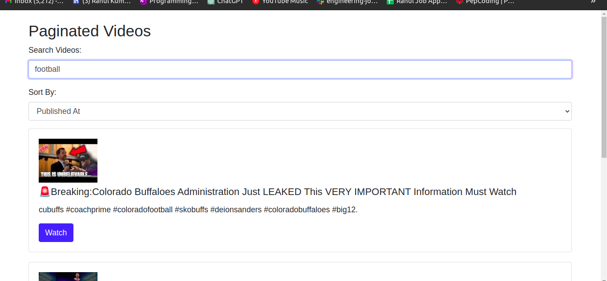
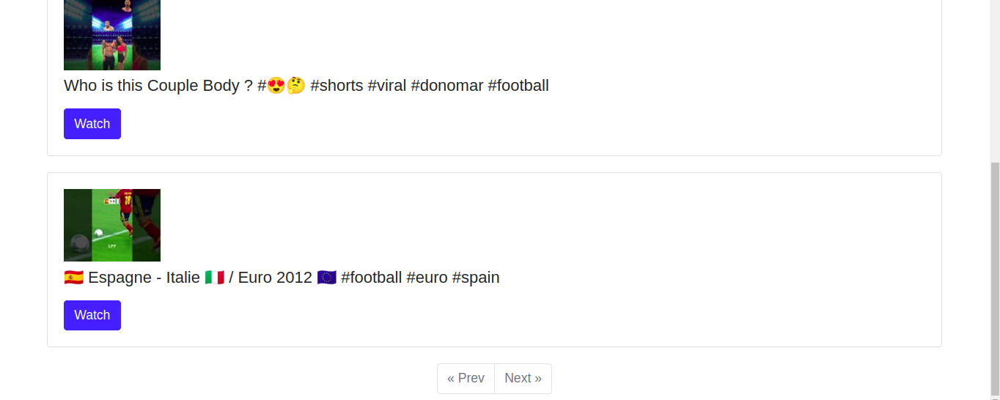
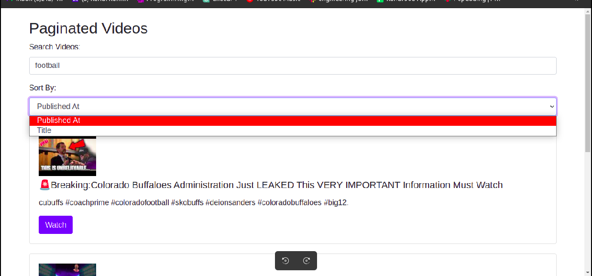
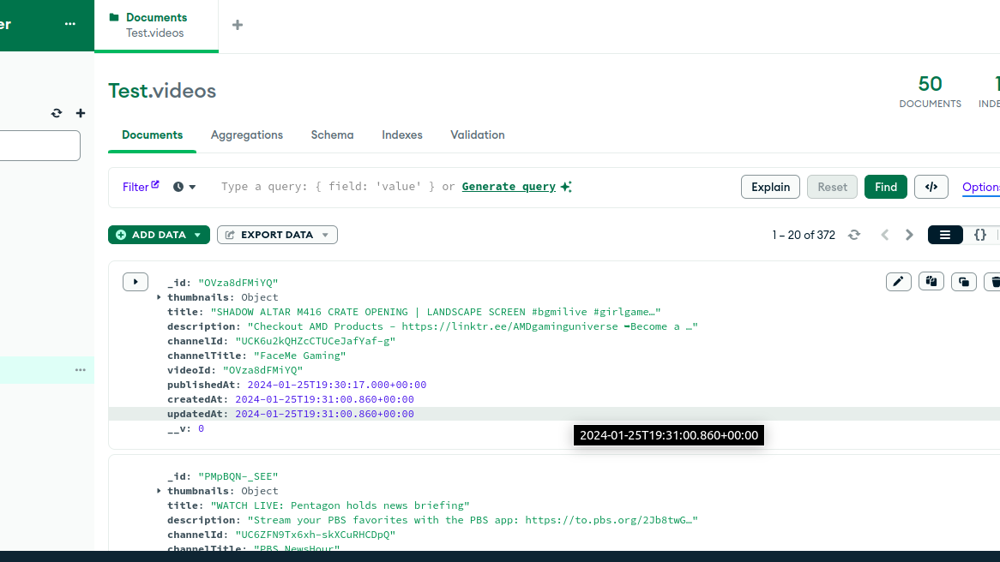

## FamPay | Assignment

### Project Goal

To make an API to fetch latest videos sorted in reverse chronological order of their publishing date-time from YouTube for a given tag/search query in a paginated response.

### Functionalities

- The server continuously calls the YouTube API in the background every 1 minute.
- It fetches the latest videos based on a predefined search query.
- Fetched video data, including title, description, publishing datetime, thumbnails    URLs, and other relevant fields, is stored in a database in descending order of published datetime.
- A GET API is provided to retrieve stored video data in a paginated response.
- A search API enables users to search stored videos using their title and description.
- The search API is optimized to perform partial matches in either the video title or description.Example: A video titled "How to make tea?" matches the search query "tea how."

### Development

1. Clone the project

`git clone https://github.com/imrahulv/fampay-youtube-project.git`

2. In [.env](https://github.com/imrahulv/fampay-youtube-project/blob/master/.env) add your actual MONGODB_URI, YOUTUBE_SEARCH_QUERY, YOUTUBE_API_KEY

NOTE - You can enter multiple api keys separated by comma
```
YOUTUBE_API_KEY = "<API_KEY1>, <API_KEY2>..."
```

3. Install dependencies

`npm install`

4. Run in development mode

`npm run dev`

### How to run in Docker

When using Docker Compose, 

1. Create a `.env` file using the instructions mentioned above
2. Set the `MONGODB_URI` environment variable in your `.env` file to

```
MONGODB_URI = mongodb://mongo:27017
```
3. Run:

```
docker-compose up -d
```
4. Go to this url `http://localhost:3000` and you can see the app
5. You can monitor the data in MongoDB by navigating to `http://localhost:8081`

### Results

1. Searching based on title and description


2. We can navigate to the previous and next page using prev and next button


3. Sorting the results based on published date and title


4. Data is stored in mongoDb database



